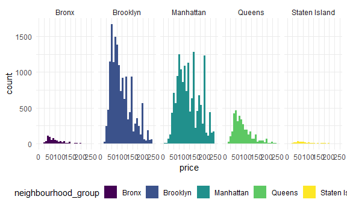
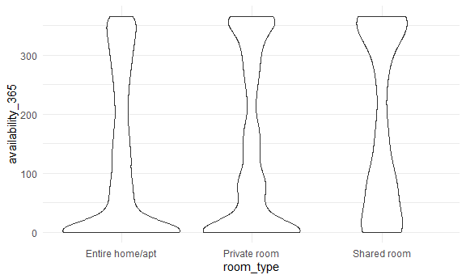

case_study
================

``` r
library(tidyverse)
```

    ## ── Attaching core tidyverse packages ──────────────────────── tidyverse 2.0.0 ──
    ## ✔ dplyr     1.1.4     ✔ readr     2.1.5
    ## ✔ forcats   1.0.0     ✔ stringr   1.5.1
    ## ✔ ggplot2   3.5.1     ✔ tibble    3.2.1
    ## ✔ lubridate 1.9.3     ✔ tidyr     1.3.1
    ## ✔ purrr     1.0.2     
    ## ── Conflicts ────────────────────────────────────────── tidyverse_conflicts() ──
    ## ✖ dplyr::filter() masks stats::filter()
    ## ✖ dplyr::lag()    masks stats::lag()
    ## ℹ Use the conflicted package (<http://conflicted.r-lib.org/>) to force all conflicts to become errors

``` r
knitr::opts_chunk$set(
  fig.width = 6,
  fig.asp = .6,
  out.width = "90%"
)

theme_set(theme_minimal() + theme(legend.position = "bottom"))

options(
  ggplot2.continuous.colour = "viridis",
  ggplot2.continuous.fill = "viridis"
)

scale_colour_discrete = scale_colour_viridis_d
scale_fill_discrete = scale_fill_viridis_d
```

Load packages.

``` r
library(p8105.datasets)

data(nyc_airbnb)
```

## Brainstorm questions

- Where are max and min airbnb prices?
  - What are average prices?
- Where are prices going up and down over time?
- What’s the relationship between number of reviews and average review?
- Does room type affect availability?
- What’s the location of the unit?
  - What areas are popular?
- Are there repeat hosts?
  - If so, what does that mean?

``` r
max(pull(nyc_airbnb, price))
```

    ## [1] 10000

``` r
min(pull(nyc_airbnb, price))
```

    ## [1] 10

``` r
mean(pull(nyc_airbnb, price))
```

    ## [1] 145.2864

``` r
summary(nyc_airbnb) #but not a tidy way
```

    ##        id           review_scores_location     name          
    ##  Min.   :    2515   Min.   : 2.000         Length:40753      
    ##  1st Qu.: 4995083   1st Qu.: 9.000         Class :character  
    ##  Median :10019312   Median :10.000         Mode  :character  
    ##  Mean   : 9912016   Mean   : 9.418                           
    ##  3rd Qu.:14967994   3rd Qu.:10.000                           
    ##  Max.   :18519989   Max.   :10.000                           
    ##                     NA's   :10037                            
    ##     host_id           host_name         neighbourhood_group neighbourhood     
    ##  Min.   :       72   Length:40753       Length:40753        Length:40753      
    ##  1st Qu.:  4857042   Class :character   Class :character    Class :character  
    ##  Median : 18051286   Mode  :character   Mode  :character    Mode  :character  
    ##  Mean   : 30590310                                                            
    ##  3rd Qu.: 46649875                                                            
    ##  Max.   :128484889                                                            
    ##                                                                               
    ##       lat              long        room_type             price        
    ##  Min.   :-74.24   Min.   :40.50   Length:40753       Min.   :   10.0  
    ##  1st Qu.:-73.98   1st Qu.:40.69   Class :character   1st Qu.:   70.0  
    ##  Median :-73.96   Median :40.72   Mode  :character   Median :  100.0  
    ##  Mean   :-73.96   Mean   :40.73                      Mean   :  145.3  
    ##  3rd Qu.:-73.94   3rd Qu.:40.76                      3rd Qu.:  170.0  
    ##  Max.   :-73.71   Max.   :40.91                      Max.   :10000.0  
    ##                                                                       
    ##  minimum_nights     number_of_reviews  last_review         reviews_per_month
    ##  Min.   :   1.000   Min.   :  0.00    Min.   :2010-06-15   Min.   :  0.010  
    ##  1st Qu.:   1.000   1st Qu.:  1.00    1st Qu.:2016-09-25   1st Qu.:  0.250  
    ##  Median :   2.000   Median :  4.00    Median :2017-03-13   Median :  0.750  
    ##  Mean   :   3.965   Mean   : 16.41    Mean   :2016-11-26   Mean   :  1.312  
    ##  3rd Qu.:   3.000   3rd Qu.: 18.00    3rd Qu.:2017-04-18   3rd Qu.:  1.910  
    ##  Max.   :1250.000   Max.   :432.00    Max.   :2017-05-04   Max.   :125.920  
    ##                                       NA's   :9185         NA's   :9299     
    ##  calculated_host_listings_count availability_365
    ##  Min.   : 1.000                 Min.   :  0.0   
    ##  1st Qu.: 1.000                 1st Qu.:  0.0   
    ##  Median : 1.000                 Median : 84.0   
    ##  Mean   : 1.663                 Mean   :134.1   
    ##  3rd Qu.: 2.000                 3rd Qu.:277.0   
    ##  Max.   :35.000                 Max.   :365.0   
    ## 

``` r
nyc_airbnb  |> 
  ggplot(aes(x = price, fill = neighbourhood_group)) +
  geom_histogram() +
  facet_grid(. ~ neighbourhood_group) +
  scale_x_continuous(limits = c(0, 250))
```

    ## `stat_bin()` using `bins = 30`. Pick better value with `binwidth`.

    ## Warning: Removed 3810 rows containing non-finite outside the scale range
    ## (`stat_bin()`).

    ## Warning: Removed 10 rows containing missing values or values outside the scale range
    ## (`geom_bar()`).



``` r
#(this gives a color-coded histogram showing the distribution of prices by borough; Manhattan seems to be more uniformly distributed and possibly bimodal; the others seem right-skewed)
```

``` r
plot = ggplot(data = nyc_airbnb, aes(x = room_type, y = availability_365)) +
  geom_violin()
print(plot)
```



``` r
#repeat hosts
nyc_airbnb %>%
  filter(calculated_host_listings_count > 1) |> 
  distinct(host_id, host_name, calculated_host_listings_count)
```

    ## # A tibble: 3,944 × 3
    ##     host_id host_name         calculated_host_listings_count
    ##       <dbl> <chr>                                      <dbl>
    ##  1  3684360 Enrique                                        4
    ##  2 11305944 Yahaira                                        3
    ##  3   873273 Christian & Carla                              4
    ##  4 16286162 Pat                                            4
    ##  5 23732730 Fenton                                         2
    ##  6 44213272 Gema                                           5
    ##  7  1448564 Burak                                          2
    ##  8 46250803 Mark                                           2
    ##  9 24597265 Freda                                          8
    ## 10  7686262 Sarah                                          2
    ## # ℹ 3,934 more rows
